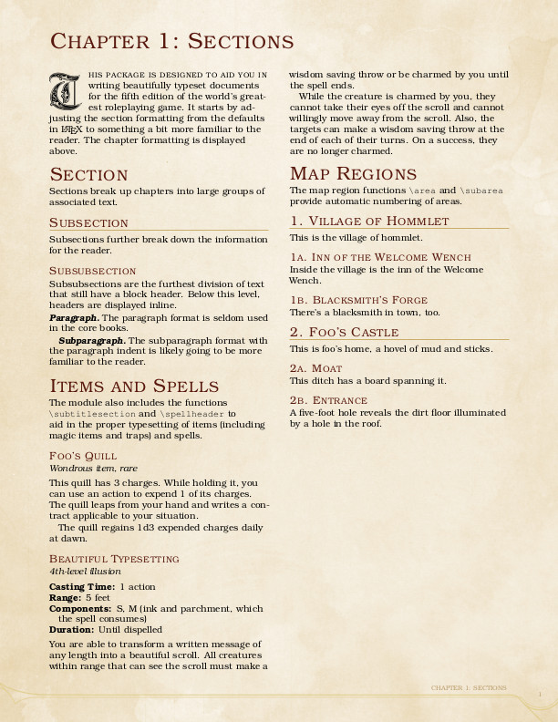

# DnD 5e LaTeX Template

[](https://github.com/rpgtex/DND-5e-LaTeX-Template/releases/latest)
[](https://circleci.com/gh/rpgtex/DND-5e-LaTeX-Template)

This is a LaTeX template for typesetting documents in the style of the fifth edition of the "world's greatest roleplaying game".

## Features

* Color schemes and fonts are close to the core books.
* TeX Live includes the default fonts.
* Works with pdfTeX, LuaTeX, and XeTeX.



## Installation

There are three options for using this project; choose the one that's
right for you.

### Using Overleaf

[Overleaf](https://overleaf.com) is an online TeX editor -- think
about it like Google Docs for TeX documents.  This option does not
require a local TeX installation and is an ideal approach for one-off
projects.

1. Download this GitHub repository as a ZIP archive using the *Clone
   or download* link above.
2. On Overleaf, click the *New Project* button and select *Upload
   Project*.  Upload the ZIP archive you downloaded from this
   repository.

### User install using `TEXMFHOME` (recommended)

This will install the template for your current user in one of the following locations:

* Linux: `~/.texmf/tex/latex`
* OS X / macOS: `~/Library/texmf/tex/latex`
* Windows: `C:\Users\{username}\texmf\tex\latex`

LaTeX will find the package automatically.

1. Prepare your `TEXMFHOME` directory.

    ```sh
    mkdir "$(kpsewhich -var-value TEXMFHOME)/tex/latex/"
    ```
2. Download the [latest release](https://github.com/rpgtex/DND-5e-LaTeX-Template/releases/latest) and extract it in `$TEXMFHOME/tex/latex/`.

    ```sh
    wget https://github.com/rpgtex/DND-5e-LaTeX-Template/archive/v0.7.0.zip
    unzip -d "$(kpsewhich -var-value TEXMFHOME)/tex/latex/" v0.7.0.zip
    cd "$(kpsewhich -var-value TEXMFHOME)/tex/latex/"
    mv DND-5e-LaTeX-Template-0.7.0 dnd
    ```

    Alternatively, clone the repo to the same location:

    ```sh
    git clone https://github.com/rpgtex/DND-5e-LaTeX-Template.git "$(kpsewhich -var-value TEXMFHOME)/tex/latex/dnd"
    ```

### Project install using `TEXINPUTS`

You can also clone a copy of the repository to each LaTeX project. For example, to clone the repository to a `lib/` directory in your project:

```sh
mkdir lib/
git clone https://github.com/rpgtex/DND-5e-LaTeX-Template.git lib/dnd
```

LaTeX will not find the template automatically. Set `TEXINPUTS` when compiling your project to locate the package:

```sh
TEXINPUTS=./lib//: pdflatex project.tex
```

## Usage

### Class (recommended)

Load the `dndbook` class in your preamble:

```tex
\documentclass[10pt,twoside,twocolumn,openany]{dndbook}

\usepackage[english]{babel}
\usepackage[utf8]{inputenc}

\begin{document}
% ...
```

### Package

You can also load the `dnd` package directly to use it with another class.
Note that the package has only been tested with the `book` class.

```tex
\documentclass[10pt,twoside,twocolumn,openany]{book}

\usepackage[english]{babel}
\usepackage[utf8]{inputenc}

\usepackage[layout=true]{dnd}

\begin{document}
% ...
```

### Options

| Option         | Package `dnd`   | Class `dndbook`   |
| -------------- | :-------------: | :---------------: |
| `altdropfont`  | ?               | ✓                 |
| `bg`           | ✓               | ✓                 |
| `justified`    | ✓               | ✓                 |
| `layout`       | ✓               |                   |
| `nomultitoc`   | ✓               | ✓                 |

The `dndbook` class also supports all the options of the `book` class.

#### `altdropfont`

Use atlernate (gothic) font for drop capitals.

#### `bg`

Declare how to load background and footer images. This is a key-value option with the following possible values:

* `full`: Load both background and footer images. (**default**)
* `none`: Removes both background and footer images.
* `print`: Loads only the footer images.

#### `justified`

Justify column copy.

#### `layout`

Controls whether loading the `dnd` package also modifies the document layout (geometry, colors, typography, etc.).
This is a boolean option with the following possible values:

* `true`: Modify the document layout.
* `false`: Do not modify the document layout.

The default value is `true` for backwards compatibility with early releases.
This will change in a future release.

#### `nomultitoc`

Disable multi-column table of contents.

## Dependencies

If you don't have LaTeX installed, we recommend installing a complete [TeX Live distribution](https://www.tug.org/texlive/).

### Ubuntu

```sh
sudo apt-get install texlive-full
```

### Arch

```sh
sudo pacman -S texlive-bin texlive-core texlive-latexextra
```

### OSX

MacTex has its own [installer](https://www.tug.org/mactex/), but you can install it through brew cask:

#### Full version

```sh
brew cask install mactex
```

#### Slightly smaller version without GUI

```sh
brew cask install mactex-no-gui
```

#### Minimal version

Use `tlmgr` to install packages as needed, see this [answer](https://tex.stackexchange.com/a/470285) for more information

```sh
brew cask install basictex
brew cask install tex-live-utility
```

After any of this, use the following such that the texlive directory doesn't require admin rights.

```sh
sudo chown -R myuser:mygroup /usr/local/texlive
```

For more information about MacTex permissions, see the following StackExchange [post](https://tex.stackexchange.com/questions/3744/how-do-i-set-up-mactex-so-admin-rights-arent-necessary)

## Known issues and solutions

### Stat block text color does not survive page breaks

This is a known issue in `tcolorbox`. According to the `tcolorbox` 4.12 manual (p. 363):

> If your text content contains some text color changing commands, your color will not survive the break to the next box.

You can use LuaTeX to compile the document.

```sh
lualatex main.tex
```

### Wrapping `monsterbox` in float disrupts spacing inside stat block

Wrapping a `monsterbox` (or `monsterboxnobg`) in a floating figure adds extra space between stat block elements:

```latex
\begin{figure}[b]
  \begin{monsterbox}{Orc Warden}
    % ...
  \end{monsterbox}
\end{figure}
```

Instead, use the `tcolorbox` `float` parameter:

```latex
\begin{monsterbox}[float=b]{Orc Warden}
  % ...
\end{monsterbox}
```

Refer to the `tcolorbox` documentation (section 4.13) for more float parameters.

## Contributing

### Style

We use [EditorConfig](https://editorconfig.org/) to enforce consistent formatting.
Install the appropriate plugin for your editor.

### Preparing a new release

1. Run `./bin/bump-version` to tag the new version.

    ```sh
    ./bin/bumpversion <version>
    ```
2. Compile the example PDF.
3. Save the first page of the PDF as scrot.jpg.
4. Update the change log for the new release; commit your changes.
5. Push changes.

    ```sh
    git push && git push --tags
    ```
6. [Create a new release](https://help.github.com/articles/creating-releases/) and attach the PDF and scrot.

## Credits

* Background image from [Lost and Taken](https://lostandtaken.com/)

## License

MIT
